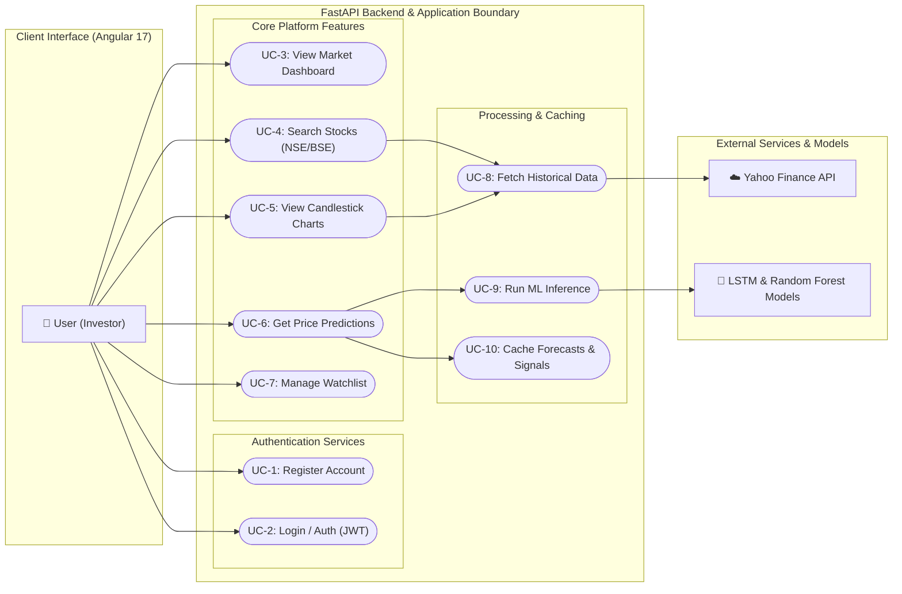
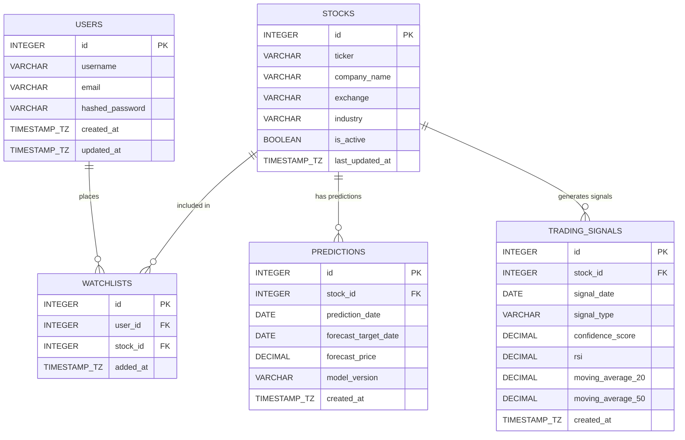

# System & Database Design Documentation
## Stock Market Prediction & Analysis System

This document outlines the system architecture, use case requirements, database entity relationships, and table schemas for the Stock Market Prediction & Analysis System (Angular + FastAPI + Machine Learning).

---

## 1. Use Case Diagram

The use case diagram illustrates the functional requirements of the system, showcasing how the primary Actor (User) interacts with the system, and how the Backend Engine (FastAPI) coordinates with external services (Yahoo Finance) and Machine Learning models (LSTM & Random Forest).

### Use Case Description

*   **UC-1: Register Account**: Allows new users to create credentials (username, email, password) to gain access to personalized watchlists and dashboard features.
*   **UC-2: Login / Auth (JWT)**: Validates user credentials and issues a JSON Web Token (JWT) for secure session management.
*   **UC-3: View Market Dashboard**: Displays top-moving stocks, mini-charts, and general market summaries on the landing page.
*   **UC-4: Search Stocks (NSE/BSE)**: Provides autocomplete search for tickers (e.g., `RELIANCE.NS`, `TCS.NS`) on the Indian stock exchanges.
*   **UC-5: View Candlestick Charts**: Renders TradingView candlestick graphs overlaying SMA and EMA technical indicators.
*   **UC-6: Get Price Predictions**: Displays the 7-day and 30-day LSTM-forecasted prices along with a classification signal (BUY/HOLD/SELL) from the Random Forest model.
*   **UC-7: Manage Watchlist**: Allows users to save their favorite stocks to their personal profile for quick access.
*   **UC-8: Fetch Historical Data**: Backend component that fetches daily historical prices using the `yfinance` library.
*   **UC-9: Run ML Inference**: Loads trained weights to feed historical price data (60 days back) into the LSTM and technical indicators into the Random Forest model.
*   **UC-10: Cache Forecasts & Signals**: Caches generated model outputs for 24 hours to reduce CPU overhead and API network requests.

---

## 2. Table List

The database schema is organized into 5 relational tables to support user management, watchlists, stock tracking, predictions caching, and technical indicators/trading signals.

### 2.1 Table Index
1.  **`users`**: Stores user authentication credentials and account metadata.
2.  **`stocks`**: Caches basic info of tracked stocks to speed up searches and autocomplete.
3.  **`watchlists`**: A join table mapping users to their watched stocks (Many-to-Many).
4.  **`predictions`**: Caches LSTM price predictions for up to 24 hours.
5.  **`trading_signals`**: Caches Random Forest signals and technical indicator overlays.

---

### 2.2 Table Details

#### Table: `users`
Stores user profile information and security credentials.

| Column Name | Data Type | Key | Constraints | Default | Description |
| :--- | :--- | :---: | :--- | :--- | :--- |
| `id` | SERIAL / INTEGER | PK | AUTOINCREMENT, NOT NULL | | Unique identifier for the user. |
| `username` | VARCHAR(50) | | UNIQUE, NOT NULL, INDEX | | User's unique login username. |
| `email` | VARCHAR(100) | | UNIQUE, NOT NULL, INDEX | | User's email address. |
| `hashed_password` | VARCHAR(255) | | NOT NULL | | Securely hashed password. |
| `created_at` | TIMESTAMP WITH TZ | | NOT NULL | CURRENT_TIMESTAMP | Account creation date. |
| `updated_at` | TIMESTAMP WITH TZ | | NOT NULL | CURRENT_TIMESTAMP | Timestamp of last account update. |

#### Table: `stocks`
Caches NSE/BSE tickers and stock company profiles.

| Column Name | Data Type | Key | Constraints | Default | Description |
| :--- | :--- | :---: | :--- | :--- | :--- |
| `id` | SERIAL / INTEGER | PK | AUTOINCREMENT, NOT NULL | | Unique identifier for the stock record. |
| `ticker` | VARCHAR(20) | | UNIQUE, NOT NULL, INDEX | | Stock symbol (e.g., `TCS.NS`, `RELIANCE.NS`). |
| `company_name` | VARCHAR(150) | | NOT NULL | | Official name of the corporation. |
| `exchange` | VARCHAR(10) | | NOT NULL | | Exchange code (e.g., `NSE`, `BSE`). |
| `industry` | VARCHAR(100) | | NULL | | Sector or industrial domain. |
| `is_active` | BOOLEAN | | NOT NULL | TRUE | Status indicating active monitoring. |
| `last_updated_at`| TIMESTAMP WITH TZ | | NOT NULL | CURRENT_TIMESTAMP | Time when yfinance last updated metadata. |

#### Table: `watchlists`
Links users to their watched stocks.

| Column Name | Data Type | Key | Constraints | Default | Description |
| :--- | :--- | :---: | :--- | :--- | :--- |
| `id` | SERIAL / INTEGER | PK | AUTOINCREMENT, NOT NULL | | Unique identifier for the watchlist item. |
| `user_id` | INTEGER | FK | REFERENCES `users(id)` ON DELETE CASCADE | | ID of the user owning the watchlist. |
| `stock_id` | INTEGER | FK | REFERENCES `stocks(id)` ON DELETE CASCADE | | ID of the watched stock. |
| `added_at` | TIMESTAMP WITH TZ | | NOT NULL | CURRENT_TIMESTAMP | Date the stock was added to watchlist. |

*Note: There is a composite UNIQUE constraint on `(user_id, stock_id)` to prevent duplicate listings.*

#### Table: `predictions`
Caches LSTM price predictions (cached for 24 hours).

| Column Name | Data Type | Key | Constraints | Default | Description |
| :--- | :--- | :---: | :--- | :--- | :--- |
| `id` | SERIAL / INTEGER | PK | AUTOINCREMENT, NOT NULL | | Unique prediction data row ID. |
| `stock_id` | INTEGER | FK | REFERENCES `stocks(id)` ON DELETE CASCADE | | ID of the prediction's target stock. |
| `prediction_date` | DATE | | NOT NULL, INDEX | | Date when prediction inference occurred. |
| `forecast_target_date`| DATE | | NOT NULL | | The future date for which price is forecast. |
| `forecast_price` | DECIMAL(12, 4)| | NOT NULL | | LSTM-forecasted closing price. |
| `model_version` | VARCHAR(50) | | NOT NULL | 'LSTM-v1.0' | Version of the model used. |
| `created_at` | TIMESTAMP WITH TZ | | NOT NULL | CURRENT_TIMESTAMP | Timestamp when record was cached. |

*Note: Composite index on `(stock_id, prediction_date)` ensures rapid lookup of cached daily predictions.*

#### Table: `trading_signals`
Caches Random Forest signals and supporting technical indicators.

| Column Name | Data Type | Key | Constraints | Default | Description |
| :--- | :--- | :---: | :--- | :--- | :--- |
| `id` | SERIAL / INTEGER | PK | AUTOINCREMENT, NOT NULL | | Unique signal data row ID. |
| `stock_id` | INTEGER | FK | REFERENCES `stocks(id)` ON DELETE CASCADE | | ID of the signal's target stock. |
| `signal_date` | DATE | | NOT NULL, INDEX | | Date when signal was computed. |
| `signal_type` | VARCHAR(10) | | CHECK (`signal_type` IN ('BUY', 'HOLD', 'SELL')), NOT NULL | | Generated signal recommendation. |
| `confidence_score`| DECIMAL(5, 4) | | NOT NULL | | Classification confidence level (0.0 to 1.0).|
| `rsi` | DECIMAL(6, 3) | | NULL | | Relative Strength Index (RSI-14) overlay. |
| `moving_average_20`| DECIMAL(12, 4)| | NULL | | 20-day Simple Moving Average (SMA). |
| `moving_average_50`| DECIMAL(12, 4)| | NULL | | 50-day Simple Moving Average (SMA). |
| `created_at` | TIMESTAMP WITH TZ | | NOT NULL | CURRENT_TIMESTAMP | Timestamp when record was cached. |

---

## 3. Entity-Relationship (ER) Diagram

The ER Diagram shows relationships between tables. The primary entities are `USERS` and `STOCKS`. `WATCHLISTS` is a bridging entity, and `PREDICTIONS` and `TRADING_SIGNALS` store model outputs per stock ticker.

